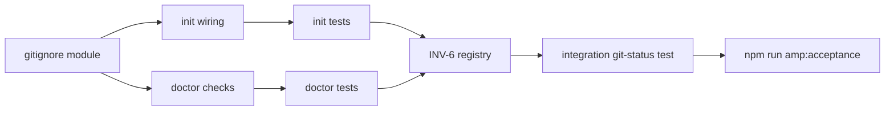

# AMP Invariant 6 — `.amp/local` Gitignore Protection Plan

**Task:** AMP-PROJ-02  
**Branch:** `ralph/amp-proj-02-invariant-six-plan`  
**Base:** `ralph/amp-v1-v1-31` @ `43595df513b08568022f1864f2f4412c2966d941`  
**Date:** 2026-05-25  
**Scope:** Planning only — no implementation in this task. No projection materialization.

---

## 1. Verdict

**Invariant 6 is specified but not enforced in code.** `amp init` and `amp doctor` do not touch `.gitignore` today. Conformance registry stops at INV-5. v1.5a should add a small git-protection module, wire it into init/doctor, register INV-6 tests, and keep acceptance offline.

**Ready for implementation:** yes, with one path-resolution decision documented below.

---

## 2. Spec anchor (Invariant 6)

From `docs/specs/AMP_CONSOLIDATED_SPEC.md` §3 Invariant 6:

| Rule | Status in codebase |
|---|---|
| Project-local AMP artifacts under `<project>/.amp/local/` | **Not implemented** — no `.amp/local/` writes yet (projection materialization deferred) |
| `amp init` MUST add `.amp/local/` to `.gitignore` | **Missing** — `runAmpInit` only writes `.amp/config.yaml` and `.amp/runtime/` |
| `amp doctor` MUST verify git-ignore via `git check-ignore` | **Missing** — doctor checks config, SSA/SAS, Hermes, path roots only |
| AMP-managed files MUST NOT appear in `git status` after AMP ops | **Untested** — no integration guard |
| `amp publish --to` exception for user-owned exports | **Not implemented** — out of scope for v1.5a gitignore slice |

Falsifiable acceptance test (spec): init in a git repo, run every filesystem-materializing AMP operation, then `git status --short` must show no AMP-managed paths (unless explicitly published).

---

## 3. Current-state gap analysis

### 3.1 Init (`src/amp/cli/init.ts`) — **VERIFIED**

- Creates `.amp/config.yaml` and `.amp/runtime/runtime.db` parent dir.
- Does **not** create `.amp/local/`.
- Does **not** read or append `.gitignore`.
- Tests in `src/amp/cli/init.test.ts` assert config/runtime only; no gitignore assertions.

### 3.2 Doctor (`src/amp/cli/doctor.ts`) — **VERIFIED**

- No `gitignore` / `git-check-ignore` category.
- `formatAmpDoctorReport` / `result.ok` would need a new error path for trackable AMP artifacts.

### 3.3 Conformance (`src/amp/conformance/invariant-registry.ts`) — **VERIFIED**

- Registry maps INV-1..INV-5 only; **no INV-6 entry**.
- Acceptance policy (`acceptance-gate.ts`) allows only INV-3 deferral — adding INV-6 tests means they must **pass**, not defer.

### 3.4 Path model tension — **VERIFIED**

| Path | Spec (v1.5 projection model) | Current v1 code |
|---|---|---|
| Project projections | `.amp/local/projection.md`, `.amp/local/runtime.md` | Not written (deferred) |
| Project runtime DB | Implied under local store | `.amp/runtime/runtime.db` (`PROJECT_RUNTIME_DIR_REL` in `init.ts`) |
| Project config | Not listed as gitignored | `.amp/config.yaml` (likely operator-owned, may stay trackable) |
| Procedure registry | Not in Invariant 6 text | `.amp/procedures/` (`propagate.ts`) |

**Recommendation (PROVISIONAL until Codex confirms):** v1.5a gitignore entries:

```gitignore
# AMP-managed local artifacts (Invariant 6)
.amp/local/
.amp/runtime/
```

- `.amp/local/` — spec-required; future projection home.
- `.amp/runtime/` — covers today's runtime DB until projection/runtime consolidation lands in v1.5b.
- **Do not** gitignore `.amp/config.yaml` or `.amp/procedures/` in v1.5a unless product decides all of `.amp/` is local-only; spec currently names `.amp/local/` only.

### 3.5 Other AMP-managed paths (doctor scope, later phases)

| Path class | Gitignore via init? | Doctor check? | Notes |
|---|---|---|---|
| `.amp/local/**` | Yes (v1.5a) | Yes | Primary Invariant 6 target |
| `.amp/runtime/**` | Yes (v1.5a interim) | Yes | **VERIFIED** current init output |
| `~/.amp/**` | No (outside repo) | N/A | Global store; not project gitignore |
| `**/from-amp/**` | No default | Optional warning | Harness artifacts; teams may intentionally commit; not `.amp/local` |
| `amp publish` export | User path | N/A | Explicit exception in spec |

---

## 4. Proposed implementation path

### Phase A — Shared gitignore module (new)

**Location:** `src/amp/gitignore/` (mirrors `src/amp/path-safety/` for Invariant 4)

| File | Responsibility |
|---|---|
| `src/amp/gitignore/paths.ts` | Canonical constants: `AMP_LOCAL_DIR_REL = ".amp/local/"`, `AMP_RUNTIME_DIR_REL = ".amp/runtime/"`, `DEFAULT_AMP_GITIGNORE_LINES`, `listAmpManagedProjectRelPaths()` |
| `src/amp/gitignore/ensure.ts` | `ensureAmpGitignoreEntries(projectRoot, options?)` — read/create `.gitignore`, idempotently append missing lines, preserve user content; return `{ gitignorePath, entriesAdded, entriesPresent }` |
| `src/amp/gitignore/check.ts` | `checkAmpGitignoreProtection(projectRoot, options?)` — for each managed rel path, probe representative file with `git check-ignore -q`; detect trackable artifacts via `git ls-files`; return structured findings |
| `src/amp/gitignore/ensure.test.ts` | Unit tests for append/idempotency/missing-file creation |
| `src/amp/gitignore/check.test.ts` | Unit tests with real temp git repos (`git init`) |

**Design constraints:**

- Use `spawnSync` / `execFileSync` with argv arrays only (IDENTITY injection rule).
- Skip git checks when project root is not inside a git work tree (`git rev-parse --is-inside-work-tree`); doctor emits **info**, not error.
- Gitignore line format: trailing slash directory patterns per spec (`.amp/local/`).
- Marker comment optional: `# AMP-managed (Invariant 6)` above block for support/debug — single append block, not scattered lines.

### Phase B — Wire `amp init`

**Location:** `src/amp/cli/init.ts`

1. After config/runtime setup, call `ensureAmpGitignoreEntries(projectRoot)`.
2. Extend `AmpInitResult` with `gitignorePath`, `gitignoreEntriesAdded`.
3. Update `formatAmpInitMessages` to print `+ .gitignore` or `✓ .gitignore` lines.
4. Create `.amp/local/` directory (empty, `mkdir` recursive) so doctor has a probe target even before projections exist — **does not** materialize projection files (task constraint).

**CLI:** no new flags required; `--force` does not rewrite `.gitignore` except to ensure missing entries (never strip user lines).

### Phase C — Wire `amp doctor`

**Location:** `src/amp/cli/checks/gitignore-protection.ts` (new, imported by `doctor.ts`)

1. Category `gitignore-protection`:
   - **ok** — all probe paths ignored by `git check-ignore`.
   - **warning** — not a git repo, or `.gitignore` missing AMP block but fixable.
   - **error** — trackable AMP-managed files present (`git ls-files` hits under `.amp/local/` or `.amp/runtime/`).
2. When inside git worktree and entries missing, message should say: run `amp init` (or manually add lines).
3. Map to `result.ok = false` only on **error** (trackable artifacts), matching spec "MUST verify" severity.

**Also update:** `src/amp/cli/doctor.test.ts` with git-fixture cases.

### Phase D — Conformance registry

**Location:** `src/amp/conformance/invariant-registry.ts`

```typescript
INV_6_LOCAL_GITIGNORE: "INV-6",
// ...
{
  invariantId: INVARIANT_IDS.INV_6_LOCAL_GITIGNORE,
  description: "AMP-managed project-local artifacts are git-ignored and not trackable",
  testFiles: [
    "src/amp/gitignore/ensure.test.ts",
    "src/amp/gitignore/check.test.ts",
    "src/amp/cli/init.test.ts",        // after gitignore assertions added
    "src/amp/cli/doctor.test.ts",      // after gitignore assertions added
    "src/amp/integration/invariant-6-git-status.test.ts",
  ],
},
```

No change to acceptance gate live-service disclaimer — INV-6 tests stay offline (local `git` only).

### Phase E — Integration git-status test (new)

**Location:** `src/amp/integration/invariant-6-git-status.test.ts`

**Pattern:** temp dir → `git init` → `runAmpInit` → simulate AMP artifact touch:

- Write `.amp/local/.probe` and `.amp/runtime/runtime.db` (or use init-created paths).
- Optionally run `runAmpPropagate` with injected registry if from-amp should remain visible in status (assert from-amp **may** appear — only `.amp/*` managed paths must not).

Assert:

```bash
git status --short --untracked-files=all
```

returns empty for paths under `.amp/local/` and `.amp/runtime/`.

**Label:** test design **VERIFIED** against spec falsifiable test; runtime depends on Phase A–C landing.

---

## 5. Test plan (required coverage)

### 5.1 `amp init` adds `.amp/local/` to `.gitignore`

| Test | File | Assertion |
|---|---|---|
| Appends `.amp/local/` to new `.gitignore` | `ensure.test.ts` | File contains exact line |
| Idempotent second init | `init.test.ts` | No duplicate lines |
| Creates `.amp/local/` dir without projection files | `init.test.ts` | Dir exists; no `projection.md` |
| Works when `.gitignore` pre-exists with other rules | `ensure.test.ts` | Preserves unrelated lines |
| Non-git directory | `init.test.ts` | Init succeeds; gitignore still written (operator may `git init` later) — **PROVISIONAL** |

### 5.2 `amp doctor` detects trackable `.amp/local` artifacts

| Test | File | Assertion |
|---|---|---|
| Clean ignored tree → ok finding | `doctor.test.ts` | `[gitignore-protection]` ok |
| `git add -f .amp/local/x` → error | `check.test.ts` / `doctor.test.ts` | error + trackable path listed |
| Missing gitignore entry → warning/error | `doctor.test.ts` | Actionable message |
| Outside git repo → info skip | `doctor.test.ts` | No false error |

### 5.3 `git status` clean after AMP operations

| Test | File | Assertion |
|---|---|---|
| Post-init status clean for `.amp/**` managed paths | `invariant-6-git-status.test.ts` | `git status --short` empty |
| Post-touch of runtime db | same | Still ignored |
| Documented exception: `amp publish` | deferred | Add when publish lands |

---

## 6. File touch list (implementation task, not this commit)

| Action | Path |
|---|---|
| **Add** | `src/amp/gitignore/paths.ts` |
| **Add** | `src/amp/gitignore/ensure.ts` |
| **Add** | `src/amp/gitignore/check.ts` |
| **Add** | `src/amp/gitignore/ensure.test.ts` |
| **Add** | `src/amp/gitignore/check.test.ts` |
| **Add** | `src/amp/cli/checks/gitignore-protection.ts` |
| **Add** | `src/amp/integration/invariant-6-git-status.test.ts` |
| **Edit** | `src/amp/cli/init.ts` |
| **Edit** | `src/amp/cli/init.test.ts` |
| **Edit** | `src/amp/cli/doctor.ts` |
| **Edit** | `src/amp/cli/doctor.test.ts` |
| **Edit** | `src/amp/conformance/invariant-registry.ts` |
| **Optional edit** | `docs/specs/AMP_CONSOLIDATED_SPEC.md` — one-line v1.5a note that `.amp/runtime/` is interim gitignored until local projection consolidation |
| **No edit** | `src/amp/conformance/acceptance-gate.ts` live-service steps |
| **No edit** | Projection writers / materialization |

---

## 7. Sequencing (v1.5a)



1. Land module + unit tests (no CLI change) — safe incremental PR.
2. Wire init + doctor + CLI message updates.
3. Register INV-6; run full acceptance.
4. Defer projection materialization to v1.5b (separate task).

---

## 8. Verification (this planning commit)

| Check | Command | Result |
|---|---|---|
| Report completeness | Manual review | Contains test plan + exact file paths |
| Acceptance gate | Not required | Spec untouched; report-only task |
| Worktree base | `git rev-parse HEAD` | `43595df513b08568022f1864f2f4412c2966d941` |

Post-implementation verification (future task):

```bash
npm run amp:acceptance
node --import tsx --test src/amp/gitignore/*.test.ts src/amp/integration/invariant-6-git-status.test.ts
```

---

## 9. External claims labels

| Claim | Label |
|---|---|
| Spec Invariant 6 text in `AMP_CONSOLIDATED_SPEC.md` | **VERIFIED** (read at base commit) |
| Init/doctor lack gitignore today | **VERIFIED** (source inspection) |
| Conformance registry ends at INV-5 | **VERIFIED** |
| `git check-ignore` behavior for directory patterns | **VERIFIED** (standard Git semantics) |
| Interim `.amp/runtime/` gitignore alongside `.amp/local/` | **PROVISIONAL** (recommended; not explicit in spec) |
| Whether `.amp/config.yaml` should remain trackable | **PROVISIONAL** |
| Cursor `@import` projection wiring | **UNKNOWN** for this task (separate spike in spec §12.6) |
| `amp publish` exception enforcement | **UNKNOWN** (command not implemented) |

---

## 10. Residual risks

1. **Path drift:** Implementing only `.amp/local/` without `.amp/runtime/` leaves today's runtime DB trackable — high risk of Invariant 6 violation on real projects.
2. **Non-git projects:** Init may write gitignore that is never used; doctor must not false-fail.
3. **Pre-existing tracked `.amp` files:** Doctor can detect via `git ls-files` but cannot auto-fix; needs explicit `git rm --cached` guidance in doctor message.
4. **Monorepo / nested git roots:** `projectRoot` must match git toplevel or use `git -C projectRoot`; edge cases need tests.
5. **Acceptance gate CLI smoke:** Temp init dir is not a git repo today — smoke passes without INV-6; integration test with `git init` is mandatory for real coverage.
6. **from-amp tracking:** Teams committing `from-amp/` is intentional; doctor must not treat as Invariant 6 failure unless spec scope expands.

---

## 11. Ready for Codex evaluation

**Yes** — plan is scoped to Invariant 6 gitignore protection, defers projection materialization, preserves offline acceptance, and names exact implementation locations and falsifiable tests.
